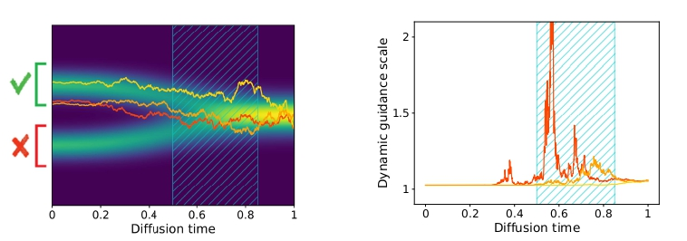
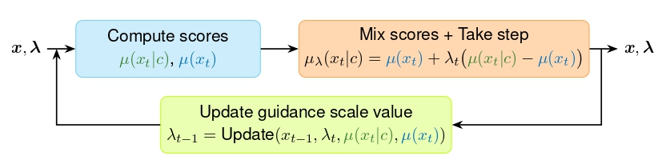

## FeedBack Gudiance of Diffusion Models &mdash; Official PyTorch implementation



**FeedBack Guidance of Diffusion Models** (under review) <br>
Felix Koulischer, Florian Handke, Johannes Deleu, Thomas Demeester and Luca Ambrogioni <br>
ArXiv link: To be added shortly<br>

## Overview of the repository

This repository is a fork of the edm2 directory [1,2] (https://github.com/NVlabs/edm2/tree/main). <br>
All credit for this repository is reserved to the owners <br>

The main modification is the `generate_imges_FBG.py` file which is designed as a flexible placeholder for the `generate_images.py` file present in the original repository. Some files, unnecessary for this work, have also been removed from the original repository. <br>

Currently the repository contains all the files required for the reproduction of the results in the context of class-conditional generation. A notebook compatible with Stable Diffusion will soon be added.



## Main changes of the repository

The main modifications made to the `generate_images_FBG.py` file are the following: 

 - The `update_log_posterior` function, which is essential for the working of FBG, is added inside the `edm_sampler`.
 
 - The functions for the relevant hyperparameters required for FBG, in particluar how tau and delta depend on `pi`, `t_0` and `t_1`, are added. <br>
       **IMPORTANT:** If tau (or `temp`) and delta (or `offset`) are explicitly specified this overrides the aforementioned functions (i.e. `t_0` and `t_1` become irrelevant).
 
 - Three distinct guidance methods are implemented: `'CFG'`[3], `'LIG'`[4] and `'FBG'` <br>
       Two hybrid methods are also added: `'Hybrid_CFG_FBG'` and `'Hybrid_LIG_FBG'`, please make sure to add all relevant hyperparameters when using these. <br>
       This can be specified using `--guidance_type`.
	   
 - Three distinct sampling schemes are implemented: `'stochastic'`, `'1st_order_Euler'` and `'2nd_order_Heun'`. <br>
       The first follows from a sampling of the backward markov chain, while the two latter follow from the PFODE. <br>
	     The PFODE methods are implemented standardly: so no added stochastic noise as present in the original file: see [1,2,5]. <br>
       This can be specified using `--sampling_type`. <br>
       **IMPORTANT:** For fair comparison remember to halven the number of timesteps when using second order methods such as `'2nd_order_Heun'` by explicitly setting the number of timesteps `--steps 32`.

 - The presets are modified to avoid the use of Autoguidance (allthough our FBG scheme can easily be reformulated to work as such). <br>
       These are defined using the FID optimized learned models and can bespecified using `--preset 'edm2-img512-{xs|s|m|l|xl}'`.
   
	   
 - A print_guidance_scale command that prints the guidance scales during inference is also implemented (this functionality should only be used when debugging/analysing the code). <br>
       To print the guidance scales through inference simply add `--print_guidance_scales` to your desired run.

## Useful commands to test out different guidance schemes

We here provide a few illustrative commands to generate image using different settings.

```.bash
# Example 1 (DinoV2 optimum): FBG + Stochastic sampling + Specifying t0 and t1 explicitly + printing the guidance scale
python generate_images_FBG.py --preset=edm2-img512-xs --outdir=your/desired/out_directory \
--seeds 0-3 --batch 4 --guidance_type 'FBG' --sampling_type 'stochastic' \
 --pi 0.999 --t_0 0.556 --t_1 0.429 ---max_guidance 10.0 \
--print_guidance_scales 
```

 ```.bash
# Example 2 (arbitrary values for tau and delta): FBG + 2nd_order_Heun + Specifying tau and delta explicitly
python generate_images_FBG.py --preset=edm2-img512-xs --outdir=your/desired/out_directory  \
--seeds 0-3 --batch 4 --guidance_type 'FBG' --sampling_type '2nd_order_Heun' --steps 32 \
 --pi 0.999 --temp 0.2 --offset -0.2 --max_guidance 10.0
```

  ```.bash
# Example 3 (DinoV2 optimum): Hybrid_LIG_FBG + 2nd_order_Heun + printing guidance_scales
python generate_images_FBG_template.py --preset=edm2-img512-xs --outdir=your/desired/out_directory \
 --seeds 0-3 --batch 4 --guidance_type 'Hybrid_LIG_FBG' --sampling_type 'stochastic' \
 --constant_guidance 2.6 --t_start 6.84 --t_end 0.48 \
--pi 0.999 --t_0 0.556 --t_1 0.492 --max_guidance 10.0 \
--print_guidance_scales
```

**IMPORTANT:** Please make sure to always pass the required hyperparameters for the desired gudiance method. If not specified default values will be used.


## Acknowledgments

We would like to express our sincere gratitude to effort made behind the implementation of the edm2 repository (available at https://github.com/NVlabs/edm2) on which our repository is based. <br>
This includes (but does not limit to) the authors of the aforementioned repository: Tero Karras, Miika Aittala, Tuomas Kynkäänniemi, Jaakko Lehtinen, Janne Hellsten, Timo Aila, Samuli Laine.

## Citation

```
@misc{Koulischer2025FBG,
  title     = {Feedback Guidance of Diffusion Models},
  author    = {Felix Koulischer and Florian Handke and Johannes Deleu and
               Thomas Demeester and Luca Ambrogioni},
  year      = {2025},
  url={https://arxiv.org/abs/???}
}
}
```


## References

[1] "Analyzing and Improving the Training Dynamics of Diffusion Models", T. Karras et al., 2024 (https://arxiv.org/abs/2312.02696) <br>
[2] "Guiding a Diffusion Model with a Bad Version of Itself", T. Karras et al., 2024 (https://arxiv.org/abs/2406.02507) <br>
[3] "Classifier-Free Diffusion Guidance", J. Ho and T. Salimans, 2022 (https://arxiv.org/abs/2207.12598) <br>
[4] "Applying Guidance in a Limited Interval Improves Sample and Distribution Quality in Diffusion Models", T. Kynkäänniemi et al., 2024 (https://arxiv.org/abs/2404.07724) <br>
[5] "Elucidating the Design Space of Diffusion-Based Generative Models", T. Karras et al., 2022 (https://arxiv.org/abs/2206.00364) <br>
